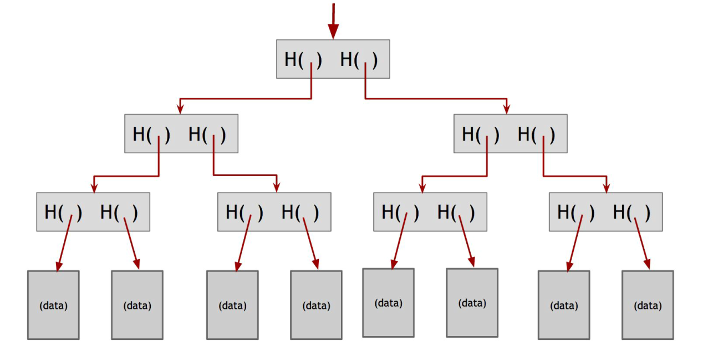

# Blockchain and Distributed Ledgers Questions & Answers 

## **Q&A**

### **Bitcoin**

#### Q: What are the key properties of a **cryptographically secure hash function**? 

A: The first cryptographic primitive that we'll need as building blocks for the cryptocurrency is a cryptographic hash function. A **hash function** is a mathematical function with the following three properties:
1. Its **input** can be any **string of any size**;
2. It produces a **fixed size output**;
3. It is **efficiently computable**.

Intuitively, the last point means that for a given input string, you can figure out what the output of the hash function is in a reasonable amount of time. More technically, **computing the hash** of an *n*-bit string should **have a running time that is $O(n)$.**

Those properties define a general hash function while a **cryptographic hash functions**, to be cryptographically secure, has the following three additional properties: (1) **collision‐resistance**, (2) **hiding**, (3) **puzzle‐friendliness**: 

1. **Collision-resistance**: A collision occurs when two distinct inputs produce the same output. A hash function $H(.)$ ​is collision‐resistant if nobody can find a collision. Formally:

    > **A hash function $H$ is said to be collision resistant if it is infeasible to find two values, $x$ and $y$, such that if $x≠y$, yet $H(x)=H(y)$.**

    ***Nobody can find a collision*, but *the collision actually exists*.** 

    The input space to the hash function contains all strings of all lengths, yet the output space contains only strings of a specific fixed length. Because the input space is larger than the output space (indeed, the input space is infinite, while the output space is finite), *there must be input strings that map to the same output string*.

    

2. **Hiding**: The *hiding* property asserts that if we're given the output of the hash function \( y = H(x)\), there's no feasible way to figure out what the input, \(x\), was. This property can't be true in the stated form. We must be slightly more precise about what we mean by hiding:

    >A **hash function** $H$ is **hiding** if: 
    >
    >When a secret value $r$ is chosen from a probability distribution that has **high min-entropy**, then given $H(r \| x)$, it is infeasible to find $x$.

    **Min‐entropy** is a measure of how predictable an outcome is, and high min‐entropy captures the intuitive idea that the distribution (i.e., random variable) is very spread out. 

    What that means specifically is that when we sample from the distribution there's no particular value that's likely to occur. So, for a concrete example, if $r$ is chosen uniformly from among all of the strings that are 256 bits long then any particular string was chosen  with probability $1/2256$, which is an  infinitesimally small value. 

     

3. **Puzzle friendliness**: 

    > A **hash function** $H$ is said to be **puzzle-friendly** if:
    >
    > For every possible $n$-bit output value $y$, if $k$ is chosen from a distribution with **high min-entropy**, then it is infeasible to find $x$ such that $H(k \| x) = y$ in time significantly less than $2^n$.

    What this means is that if someone wants to target the hash function to produce a particular output value $y$, and part of the input is chosen in a suitably randomized way, it becomes very difficult to find another input value that results in exactly that target output.
    
    


#### Q: Explain the **Merkle-Damgård construction**. What issue does it address, and how does it work? 
A: The ***Merkle-Damgård construction*** is a technique used to create cryptographic hash functions that can handle **inputs of any length while still producing a fixed-size output**. This approach is commonly used by hash functions like ***SHA-256***, which is also used by Bitcoin due to its efficiency and security.

Hash functions need to be able to take in any length of data and compress it into a manageable, consistent output. Without a structure like Merkle-Damgård, handling variable-length inputs securely and efficiently would be very challenging.

Additionally, Merkle-Damgård ensures that the hash function **maintains all the properties** of the cryptographic hash functions. 

**How It Works**: 

1. **Message Padding**: The input message is padded to a length that is a multiple of a fixed block size. Padding is usually done by adding a '$1$' bit, enough '$0$' bits to reach the necessary length, and the message's original length as metadata at the end.
   
2. **Initialization Vector (IV)**: The process starts with a predefined **Initialization Vector (IV)**. This fixed value serves as the initial input for the hash calculation and helps ensure that every hashing operation begins with the same consistent base.
   
3. **Compression Function**: The Merkle-Damgård construction uses a **compression function** that takes a fixed-size input ($m - n$) and produces a smaller, fixed-size output ($n$).
   
   The message is split into fixed-size blocks (of length $m - n$) that match the input requirements of the compression function.

4. **Chaining and Iterative Processing**: Each block is processed sequentially, where the output of one block is passed as input to the next block along with the next segment of the message. For each block, the input size is consistently $m = (m - n) + n$, as required by the compression function.
   
   The process continues, chaining each block's output with the next, ensuring a smooth, secure, and collision-resistant flow across the message.

5. **Final Output**: After processing all blocks, the output of the last block is the final hash (length $n$) of the entire message.

The ***Merkle-Damgård*** construction provides a systematic way to process any message length securely by chaining blocks of data through a collision-resistant compression function, starting with a fixed Initialization Vector. This ensures that the final output is both fixed in length and secure against common attacks, such as finding two inputs with the same hash.


#### Q: Suppose you have a 2024-bit string and a hash function that uses a compression function with a 768-bit input and a 256-bit output. Into how many chunks should the string be divided, and what should be the length of each chunk?
A: To determine the number of chunks and the length of each chunk, let’s break down the details based on the Merkle-Damgård construction:

1. **Message Length $(l)$**: 2024-bit input string.

2. **Compression Function Specifications**:
   
   - **Input length** of the compression function ($m$): 768-bit.
   - **Output length** of the compression function ($n$): 256-bits.
   
3. **Chunk Length Calculation**:
   
   - In the Merkle-Damgård construction, each chunk's length is set to match the difference between the compression function's input size and its output size.
   - Therefore, each chunk length should be ($m - n$):
     $$
     768 - 256 = 512 \text{ bits}
     $$
   
4. **Number of Chunks**:
   
   - To process the entire 2024-bit string with 512-bit chunks, we calculate the number of chunks as ($\frac{l}{m - n}$):
     $$
     \frac{2024}{512} = 3.953125
     $$
     
   - Since we cannot have a fractional chunk, we round up, so we’ll need **4 chunks** in total.
   
5. **Padding**:
   
   - To ensure we have exactly four 512-bit chunks, padding will be added to the last chunk.


So this is the **answer**: 

- **The string should be divided into 4 chunks**;

- **Each chunk should be 512 bits** in length, with padding added to the last chunk to reach 512 bits exactly.


#### Q: Explain how a **Merkle tree** works and its importance in blockchain systems.

A: A **Merkle Tree** is a binary tree with hash pointers, perfect for storing static and immutable objects like transactions. In a Merkle tree, the blockchain data blocks (the **leaves**) are grouped in pairs and the hash of each of these blocks is stored in a **parent node**. The parent nodes are in turn grouped in pairs and their hashes stored one level up the tree. This continues all the way up the tree until we reach the **root node**.  



> NOTE
>
> A **hash pointer** is a pointer to where data is stored together with a cryptographic hash of the value of that data at some fixed point in time. 

**We remember just the hash pointer at the head of the tree**. We now have the ability traverse down through the hash pointers to any point in the list (in time $O(log(n))$). This allows us make sure that the **data hasn't been tampered with** because if an adversary tampers with some data block at the bottom of the tree, that will cause the hash pointer that's one level up to not match, and even if he continues to tamper with this block, the change will eventually propagate to the top of the tree where he won't be able to tamper with the hash pointer that we've stored. So any attempt to tamper with any piece of data will be detected by just remembering the hash pointer at the top.  


#### Q: How does a **digital signature scheme** operate? Describe the two essential properties required for its security and effectiveness. 

A: **Digital Signatures** is the second cryptographic primitive, along with hash functions, that is needed as building blocks for the cryptocurrency. A digital signature is supposed to be the digital analog to a handwritten signature on paper. 

We desire **two properties** from digital signatures that correspond well to the handwritten signature analogy: 
1. **Only you can make your signature, but anyone who sees it can verify that it's valid**; 

2. **We want the signature to be tied to a particular document so that the signature cannot be used to indicate your agreement or endorsement of a different document.** 

For handwritten signatures, this latter property is analogous to assuring that somebody can't take your signature and snip it off one document and glue it onto the bottom of another one.  

A **digital signature scheme** consists of the following three algorithms:

1. `(sk, pk) := generateKeys(keysize)`

  	The `generateKeys` method takes a `key size` and generates a key pair. The secret key `sk` is kept 	privately and used to sign messages, while `pk` is the public verification key you give to everybody. 

​	Anyone with this key can verify your signature.

2. `sig := sign(sk, message)`

​	The `sign` method takes a message and a secret key, `sk`, as input and outputs a signature for 	`message` under `sk`.	

3. `isValid := verify(pk, message, sig)`

​	The `verify` method takes a `message`, a signature, and a public key as input. It returns a boolean 	value, `isValid`, which will be **true** if `sig` is a valid signature for `message` under the public key `pk`, 	and **false** otherwise.

We require that the following two properties hold:

- Verifiable - **Valid signatures must verify** : `verify(pk, message, sign(sk, message)) == true`; 

- Unforgeable - **Signatures are existentially unforgeable**. 

  

#### Q: What is a **Coinbase transaction**, and how does it differ from other transactions?

A: A **Coinbase transaction** is a special transaction analogous to CreateCoins in Scroogecoin. This is where the creation of new coins in Bitcoin happens. It mostly looks like a normal transaction but with several differences: 

1. It always has a **single input** and a **single output**;
2. The **input doesn't redeem a previous output** and thus contains a null hash pointer, since it is minting new bitcoins and not spending existing coins;
3. The **value of the output is the miner's revenue from the block**. It consists of two components: a flat mining reward, which is set by the system and which halves every 210,000 blocks (about 4 years), and the transaction fees collected from every transaction included in the block;
4. There is a **special "coinbase" parameter**, which is completely arbitrary; miners can put whatever they want in there. One way in which the coinbase parameter has been used is to signal support by miners for different new features.


#### Q: What are the **economic incentives** that drive participation in the Bitcoin network?

A: The economic incentives driving participation in the Bitcoin network primarily revolve around the **block rewards** and **transaction fees**. These incentives create a system where participants (such as miners, users, and investors) are motivated to contribute to the network's security, functionality, and growth. Below are the key economic incentives:

##### Block reward

When a miner successfully mines a block, they include a special transaction which is a **coinbase transaction**. This **creates new coins** (the ***block reward***) and pays them to a Bitcoin address of the miner's choosing. Of course miners typically assign the reward to an address they control, ensuring they receive the payment. However, they could technically specify a different recipient address if they chose to do so. You can think of this as a **payment to the node in exchange for the service of creating a block** on the consensus chain. 

Why the block reward incentivizes honest behavior? The node "collect" its reward only if the block in question ends up on the long‐term consensus branch because just like every other transaction, the coin‐creation transaction will only be accepted by other nodes if it ends up on the consensus chain. That's the key idea behind this incentive mechanism. It's a very subtle but very powerful trick. It incentivizes nodes to behave in whatever way they believe will get other nodes to extend their blocks. So if most of the network is following the longest valid branch rule, it incentivizes all nodes to continue to follow that rule. That's Bitcoin's first incentive mechanism.   	

##### Transaction fee

Is the second incentive mechanism in Bitcoin. The creator of any transaction can choose to make the total value of the transaction outputs less than the total value of its inputs. Whoever creates the block that first puts that transaction into the block chain gets to collect the difference, which acts a transaction fee. So if you're a node that's creating a block that contains, say, 200 transactions, then the sum of all those 200 transaction fees is paid to the address that you put into that block. 

The transaction fee is purely voluntary, but we expect, based on our understanding of the system, that as the block reward starts to run out, it will become more and more important, almost mandatory, for users to include transaction fees in order to get a reasonable quality of service.


#### Q: What is the **block reward** in Bitcoin? How has it changed over time, and what will happen to it in the future?

A: When a miner successfully mines a block, they include a special transaction which is a **coinbase transaction**. This **creates new coins** (the block reward) and pays them to a Bitcoin address of the miner's choosing. Of course miners typically assign the reward to an address they control, ensuring they receive the payment. However, they could technically specify a different recipient address if they chose to do so. You can think of this as a payment to the node in exchange for the service of creating a block on the consensus chain.

The value of the block reward **halves every 210,000 blocks**. Based on the rate of block creation, this means that the rate **drops roughly every four years**.  For the first four years of Bitcoin's existence, the block reward was 50 bitcoins; now it's 3,125 bitcoins and **it's going to keep halving**. This has some interesting consequences for the future. The curve representing the halving is a geometric series and means that there is a finite amount. This is a total of 21 million bitcoins.

The coinbase transaction is the only way in which new bitcoins are allowed to be created. There is no other coin generation mechanism, and that's why 21 million is a final and total number (as the rules stand now, at least) for how many bitcoins there can ever be. This new block creation reward is actually going to run out in 2140, as things stand now. Does that mean that the system will stop working in 2140 and become insecure because nodes no longer have the incentive to behave honestly? Not quite, because there is another incentive mechanism: the transaction fee.


#### Q: What is **Bitcoin halving**, and when does it happen?

A: The Bitcoin halving refers to an event that occurs approximately every **four years** (or **every 210,000 blocks**) and reduces the block reward by **50%**. This process lowers the rate at which new bitcoins enter the market, increasing scarcity and potentially raising Bitcoin's price if market conditions remain unchanged.

For the first four years of Bitcoin's existence, the block reward was **50 bitcoins**. Over time, this reward has halved multiple times: currently, it is **3.125 bitcoins**, and it will continue halving until the total supply of Bitcoin reaches its cap of **21 million coins**. The curve representing this halving process follows a geometric series, ensuring that the issuance of Bitcoin is finite and predictable.

This mechanism is fundamental to Bitcoin's design, as it controls inflation, promotes scarcity, and has significant implications for Bitcoin's future economics.


#### Q: How does the **proof-of-work** mechanism function in Bitcoin?

A: The key idea behind **_proof‐of‐work_** is that we approximate the selection of a random node by instead **selecting nodes in proportion to** a resource that we hope that nobody can monopolize. If, for example, that resource is **computing power**, then it's a ***proof‐of‐work*** system. Alternately, it could be in proportion to ownership of the currency, and that's called ***proof‐of‐stake***. 

Let's try to get a better idea of what it means to **select nodes in proportion to their computing power**. In other words we're allowing nodes to compete with each other by using their computing power, and that will result in nodes automatically being picked in that proportion. Yet another view of proof‐of‐work is that we're making it moderately hard to create new identities. It's sort of a tax on identity creation and therefore on the Sybil attack. 

Bitcoin achieves proof‐of‐work using **_hash puzzles_**. In order to create a block, the node that proposes that block is required to find a number, or **nonce**, such that when you concatenate the nonce, the previous hash, and the list of transactions that comprise that block and take the hash of this whole string, then that hash output should be a number that falls into a target space that is quite small in relation to the much larger output space of that hash function. We can define such a target space as any value falling below a certain target value. In this case, the nonce will have to satisfy the following inequality: 
$$
H(\text{nonce} \, || \, \text{prev\_hash} \, || \, \text{tx} \, || \, \text{tx} \, || \, \dots \, || \, \text{tx}) < \text{target}
$$
As we saw earlier, normally a block contains a **series of transactions** that a node is proposing. In addition, a block also contains a **hash pointer to the previous block**. In addition, we're now requiring that a block also contain a **nonce**. 

The idea is that we want to make it moderately difficult to find a nonce that satisfies this required property, which is that hashing the whole block together, including that nonce, is going to result in a particular type of output. If the hash function satisfies the puzzle‐friendliness property, then the only way to succeed in solving this hash puzzle is to just try enough nonces one by one until you get lucky. So specifically, if this target space were just one percent of the overall output space, you would have to try about 100 nonces before you got lucky. In reality, the size of this target space is not nearly as high as one percent of the output space. It’s much, much smaller than that. 

This notion of hash puzzles and proof of work completely does away with the requirement to magically pick a random node. Instead, nodes (**miners**) are simply independently competing to solve these hash puzzles all the time. Once in a while, one of them will get lucky and will find a random nonce that satisfies this property. That lucky node then gets to propose the next block. That’s how the system is completely decentralized. There is nobody deciding which node it is that gets to propose the next block.

 

#### Q: How many decimal places does a Bitcoin have?

#### Q: Define what a "**Satoshi**" is in the context of Bitcoin.

A: Bitcoin doesn’t have fixed denominations like US dollars, and in particular, there is no special designation of “1 bitcoin.” Bitcoins are just transaction outputs (**UTXOs**), and in the current rules, they can have an arbitrary value with **8 decimal places** of precision. **The smallest possible value** is 0.00000001 BTC (bitcoins), which is called 1 **Satoshi**.


#### Q: What is a **51% attack?** Describe the types of attacks it enables and how such attacks could be executed.

A: A 51% attack would happen if consensus failed and there was an **attacker** who **controls 51 percent or more of the mining power** in the Bitcoin network. There are two main possible attacks:

- Can the 51‐percent attacker **suppress some transactions**? Let’s say there is some user, Carol, whom the attacker really doesn’t like. The attacker knows some of Carol’s addresses, and wants to make sure that no coins belonging to any of those addresses can possibly be spent. 

  Since he controls the consensus process of the block chain, the attacker can simply **refuse to create any new blocks** that contain transactions from one of Carol’s addresses. The attacker can further **refuse to build upon blocks** that contain such transactions. However, he can’t prevent these transactions from being broadcast to the peer‐to‐peer network because the network doesn’t depend on the block chain, or on consensus, and we’re assuming that the attacker doesn’t fully control the network. The attacker cannot stop the transactions from reaching the majority of nodes, so even if the attack succeeds, it will at least be apparent that the attack is happening. 

- Can the attacker somehow **destroy confidence in Bitcoin**? Well, let’s imagine what would happen. If there were a variety of double‐spend attempts, situations in which nodes did not extend the longest valid branch, and other attempted attacks, then people are going to likely decide that Bitcoin is no longer acting as a decentralized ledger that they can trust. People will lose confidence in the currency, and we might expect that the exchange rate of Bitcoin will plummet. In fact, if it is known that there is a party that controls 51 percent of the hash power, then it’s possible that people will lose confidence in Bitcoin even if the attacker is not necessarily trying to launch any attacks. 

  So it is not only possible, but in fact likely, that a 51 percent attacker of any sort will destroy confidence in the currency. Indeed, this is the main practical threat if a 51 percent attack were ever to materialize. Considering the amount of expenditure that the adversary would have to put into attacking Bitcoin and achieving a 51 percent majority, none of the other attacks that we described really make sense from a financial point of view.  


#### Q: What are **Bitcoin "UTXOs"**? Explain their role in tracking Bitcoin balances and enabling transaction verification

A: Bitcoin "UTXOs" stand for **Unspent Transaction Outputs**. They are the building blocks of Bitcoin's accounting system and represent the outputs of previous Bitcoin transactions that have not yet been spent. Each UTXO is tied to a specific amount of Bitcoin and can be thought of as discrete chunks of money that belong to a Bitcoin address.

In Bitcoin, balances are not tracked as in a traditional bank ledger. Instead, a wallet calculates its balance by summing up all the UTXOs associated with its address(es). For example, if a wallet has two UTXOs, one worth 1 BTC and another worth 2 BTC, its total balance is 3 BTC.

Regarding transaction verification, UTXOs play a crucial role. To make a Bitcoin transaction, users reference one or more of their UTXOs as inputs, specify the recipient’s address in the transaction’s output, and create a new UTXO for the recipient. Any leftover amount, after subtracting the transaction value and fees, is returned to the sender as a new UTXO, often called **change**.

This UTXO model ensures that transactions are secure and efficient. The Bitcoin network verifies that all referenced UTXOs have not been previously spent, thereby preventing double-spending. Once a UTXO is used as an input for a transaction, it is marked as "spent" and can no longer be reused.

By relying on the UTXO system, Bitcoin maintains a transparent, immutable ledger. This mechanism not only simplifies the validation process but also enhances scalability and security, ensuring the integrity of the entire blockchain.


#### Q: What is the **mempool** in a blockchain network, and what role does it play in transaction processing?

A: Mempool stands for **Memory Pool**. It is a place where the transaction data needs that to be processed are stored, so it is also called as **transaction pool**. Mempool is a place which consist of all the recent and pending transactions that occurred on the blockchain network. These transactions are waiting in the queue to be validated by miners and included in the next block on the blockchain.

Memory pools are not stored on the blockchain; instead each nodes on the network has its own mempool and each mempool have a different memory capacity.

If your transaction is left unconfirmed for a long period of time then it will get cancelled and returned from the memory pool. The current mempool expiry time is set to 2 weeks, so if your transaction stays in mempool for more than 2 weeks (which is not practical) then the funds will return back to your wallet. 

If there are a large number of transactions arrive to the mempool, it will get populated and hence **delay in transactions** will occur.

Also due to limited number of nodes available the memory required to store all the unconfirmed transactions on the network also becomes limited. So to avoid being crashed due to overload of transactions; the mempool, once it reaches its size limit it will automatically sets a minimum fee threshold. Any transactions that are lower than the threshold will be removed from mempool. Only new transactions that meets mempool fees will get accepted by the memory pool.


#### Q: What is a Bitcoin **multi-signature account**, and how is it used?

A: A Bitcoin **multi-signature (MULTISIG) account** is a type of address or wallet that requires more than one private key to authorize a transaction. In a typical Bitcoin transaction, the sender uses a single private key to sign and authorize the transfer of funds. However, in a multi-signature setup, multiple private keys (owned by different individuals or entities) are required to approve a transaction before it can be executed.

**Multi-signature accounts** in Bitcoin are implemented using the `CHECKMULTISIG` script instruction, that lets you check multiple signatures with one instruction. The `CHECKMULTISIG` instruction requires specifying $n$ **public keys**, and a parameter $t$, for a **threshold**. For this instruction to execute validly, there have to be at least $t$ signatures from $t$ out of **$n$** of those public keys that are valid. This is quite a powerful primitive: we can express in a compact way the concept that $t$ out of **$n$**  specified entities must sign in order for the transaction to be valid.

MULTISIG is used to implement **escrow transactions**: For example, Alice doesn’t send the money directly to Bob, but instead creates a MULTISIG transaction that requires two of three people to sign in order to redeem the coins. And those three people are going to be Alice, Bob, and some third party arbitrator, Judy, who will come into play in case there’s any dispute. Other possible applications of MULTISIG are the efficient **micro-payments** and **lock time** feature. 


#### Q: Describe how a **micro-payment system** can be implemented using Bitcoin scripts.

A: Say that Alice is a customer who wants to continually pay Bob small amounts of money for some service that Bob provides. For example, Bob may be Alice’s wireless service provider, and requires her to pay a small fee for every minute that she talks on her phone.

Creating a Bitcoin transaction for every minute that Alice speaks on the phone won’t work. That will create too many transactions, and the transaction fees add up. If the value of each one of these transactions is on the order of what the transaction fees are, Alice is going to be paying quite a high cost to do this.

What we’d like is to be able to **combine all these small payments into one big payment at the end**. There’s a neat way to do this: 

- The process begins with a **MULTISIG transaction** that sends the maximum amount Alice might ever need to spend to an output that requires both Alice and Bob to sign in order to release the funds.

- After the first minute of Alice using the service, or the first time she needs to make a micropayment, she signs a transaction spending the funds sent to the MULTISIG address, sending a portion of the payment to Bob and returning the rest to Alice.
- After the next minute of using the service, Alice signs another transaction, this time sending two units to Bob and returning the remainder to herself. These transactions are only signed by Alice and have not been signed by Bob yet, nor are they published to the blockchain.
- Alice will continue to send these transactions to Bob every minute she uses the service. Once Alice finishes using the service, she will stop signing additional transactions.
- Upon receiving this update from Alice, Bob will sign the last transaction Alice sent him and publish it to the blockchain, completing the final transaction.

Since each transaction was paying Bob a little bit more, and Alice a little bit less, the final transaction that Bob redeems pays him in full for the service that he provided and returns the rest of the money to Alice. 

All those transactions that Alice signed along the way won’t make it to the blockchain. Bob doesn’t have to sign them. They’ll just get discarded. If both parties are operating normally, Bob will never sign any transaction but the last one, in which case the blockchain won’t actually see any attempt at a double-spend.


#### Q: How does Bitcoin’s **lock time feature** work? Provide an example of how lock time can be used in a transaction.

A: Bitcoin's **lock time** feature was designed to address specific problems in transaction scenarios, particularly in cases involving escrow-like arrangements or conditional transactions. This feature allows a transaction to **specify a time or block height** before it becomes valid and can be added to the blockchain. By doing so, it ensures that certain conditions are met before the transaction is executed, offering a safety mechanism to avoid potential deadlocks or misuse of funds.

For example, consider a **micro-payment protocol** between Alice and Bob. Before the protocol begins, Alice and Bob sign a transaction that refunds all of Alice's money back to her. However, this refund transaction is "locked" until a specific future time, denoted as time *t*. This means that before Alice broadcasts the initial multisignature transaction to put her funds into escrow, she ensures that she receives the signed refund transaction from Bob and holds onto it. This guarantees that if the agreed-upon time *t* is reached and Bob hasn't signed any small transactions that Alice has sent, Alice can broadcast the refund transaction to reclaim her funds directly.

The lock time feature plays a key role here. By setting the `lock_time` parameter in the transaction metadata, Alice specifies that the transaction is invalid until either a particular block number or a specific point in time. This prevents the transaction from being mined prematurely, ensuring it can only be executed if the conditions are not met by the specified time. For Alice, this acts as a safety valve, ensuring she gets her money back if Bob fails to cooperate.

This mechanism has broader applications beyond micro-payment protocols. For instance, it enables advanced transaction structures like multi-player lotteries, where multiple transactions are staged with different lock times to handle cases of potential cheating. Similarly, protocols using Bitcoin's scripting language can create coin-mixing systems to enhance privacy by obscuring ownership trails. These examples showcase the flexibility and power of Bitcoin's scripting capabilities, which are enhanced by the lock time feature.


#### Q: What is a **Bitcoin wallet**? Explain the differences between custodial and non-custodial wallets and between hot and cold wallets

A: A Bitcoin **wallet software** is a tool that stores and keeps track of all your coins, manages all the details of your keys, and makes things convenient with a nice user interface. Wallet software is especially useful because you typically want to use a whole bunch of different addresses with different keys associated with them. Creating a new public/private key pair is easy, and you can utilize this to improve your anonymity or privacy. Wallet software gives you a simple interface that tells you how much is in your wallet. When you want to spend bitcoins, it handles the details of which keys to use and how to generate new addresses and so on. Wallets do not physically hold Bitcoin; instead, they manage the cryptographic keys that give users control over their Bitcoin.

Bitcoin wallets come in various forms, and they can be categorized based on custody (custodial vs. non-custodial) and accessibility (hot vs. cold wallets).

The wallets managed by a third party (e.g., an exchange or service provider) are called **custodial wallets**. The service holds and controls the private keys on behalf of the user. With the **non-custodial wallets** instead, the user fully controls the private keys, meaning they have complete control over their Bitcoin.

Storing bitcoins on your computer is like carrying money around in your wallet or your purse. This is called **hot storage**. It’s convenient but also somewhat risky. On the other hand, **cold storage** is offline. It's locked away somewhere. It's not connected to the internet, and it's archival. So it’s safer and more secure, but of course, not as convenient. This is similar to how you carry some money around on your person, but put your life's savings somewhere safer.  

To have separate hot and cold storage, obviously you need to have separate secret keys for each otherwise the coins in cold storage would be vulnerable if the hot storage is compromised. You’ll want to move coins back and forth between the hot side and the cold side, so each side will need to know the other’s addresses, or public keys.  

Cold storage is not online, and so the hot storage and the cold storage won't be able to connect to each other across any network. But the good news is that cold storage doesn’t have to be online to receive coins. Since the hot storage knows the cold storage addresses, it can send coins to cold storage at any time. At any time if the amount of money in your hot wallet becomes uncomfortably large, you can transfer a chunk of it over to cold storage, without putting your cold storage at risk by connecting to the network. Next time the cold storage connects it will be able to receive from the block chain information about those transfers to it and then the cold storage will be able to do what it wants with those coins. 

But there’s a little problem when it comes to managing cold storage addresses. On the one hand, as we saw earlier, for privacy and other reasons we want to be able to receive each coin at a separate address with different secret keys. So whenever we transfer a coin from the hot side to the cold side we'd like to use a fresh cold address for that purpose. But because the cold side is not online we have to have some way for the hot side to find out about those addresses. 

The blunt solution is for the cold side to generate a big batch of addresses all at once and send those over for the hot side to use them up one by one. The drawback is that we have to periodically reconnect the cold side in order to transfer more addresses. A more effective solution is to use a **hierarchical wallet**.


#### Q: What is a **mining pool**, and how is the work done by each participant estimated and rewarded?

A: A mining pool is like a **mutual insurance** model that works for small Bitcoin miners. It is **a group of miners** that form a pool and all attempt to mine a block with a designated coinbase recipient. That recipient is called the **pool manager**. So, no matter who actually finds the block, the pool manager will receive the rewards. The pool manager will take that revenue and distribute it to all the participants in the pool based on how much work each participant actually performed. Of course, the pool manager will also probably take some kind of cut for their service of managing the pool.

***How does a pool manager know how much work each member of the pool is actually performing?*** 

Miners can prove probabilistically how much work they're doing **by outputting shares, or near‐valid blocks**. Say the target is a number beginning with 67 zeros. A block’s hash must be lower than the target for the block to be valid. In the process of searching for such a block, miners will find some blocks with hashes beginning with a lot of zeros, but not quite 67. Miners can **show** these **nearly valid blocks to prove that they are indeed working**. A share might require say 40 or 50 zeros, depending on the type of miners the pool is geared for. 

The pool manager will also run a Bitcoin node on behalf of participants, collecting transactions and assemble them into a block. The manager will include their own address in the coinbase transaction and send the block to all of the participants in the pool. All pool participants work on this block, and they prove that they've been working on it by sending in shares.  

***How can the pool manager divide the revenue commensurate with the amount of work each miner is doing?*** 

When a member of the pool finds a valid block, they sends it to the pool manager who distributes the reward **in proportion to the amount of work done**. The miner who actually finds the block is not awarded a special bonus, so if another miner did more work than, that other miner will be paid more even though they weren’t the one who ended up finding a valid block. 

There are a few options for how exactly the pool manager calculates how much to pay each miner based on the shares they submit: 

- In the **pay per share model**, the pool manager pays a **flat fee** for every share above a certain difficulty for the block that the pool is working on. In this model, miners can send their shares to the pool manager right away and get paid without waiting for the pool to find a block. 

- In the **proportional model**, instead of paying a flat fee per share, the amount of payment depends on whether or not the pool actually found a valid block. Every time a valid block is found the rewards from that block are distributed to the members proportional to how much work they actually did. 

---

### **Ethereum**

#### Q: What are the main differences between an **Externally Owned Account (EOA) and a Contract Account** in Ethereum?

A: Ethereum has two account types:

- **Externally-owned account (EOA)** – controlled by anyone with the private keys;

- **Contract account** – a smart contract deployed to the network, controlled by code. 

Both account types have the ability to:

- Receive, hold and send ETH and tokens
- Interact with deployed smart contracts

The main **differences** are:

- **Externally-owned**:
  1. Creating an account **costs nothing**;
  2. Can initiate transactions (**proactive**);
  3. **Transactions** between externally-owned accounts **can only be ETH/token transfers**;
  4. **Consist of** a pair of **public and private keys** generated with the Elliptic Curve Digital Signature Algorithm (ECDSA);
  5. An account is represented by its **public address**, a 42-character hexadecimal string obtained concatenating "0x" to the last 20 bytes of the Keccak-256 hash of the public key. 
- **Contract**: 
  1. Creating a contract **has a cost** because you're using network storage;
  2. Can only send transactions in response to receiving a transaction (**reactive**);
  3. **Transactions** from an external account to a contract account **can trigger code which can execute many different actions**, such as transferring tokens or even creating a new contract;
  4. Contract accounts don't have private keys. Instead, they are **controlled by the logic of the smart contract code**. 
  5. It is represented with an **address** in the same format as an EOA. More precisely the address comes from the creator's address (EOA address) and the number of transactions sent from that address (the `nonce`). A contract account is generated when a smart contract is deployed to the Ethereum blockchain.

EOA and CA also differ in some of the **fields** in their accounts: 

- `nonce`: A counter that indicates the **number of transactions** sent from an EOA or the **number of contracts created** by a CA;
- `balance`: The number of *wei* owned by this address;
- `codeHash`: It is null for an EOA, while for the CA it refers to the *code* of an account on the Ethereum virtual machine (EVM);
- `storageRoot`: A 256-bit hash of the root node of a Merkle Patricia trie that encodes the storage contents of the account. It is empty by default if it's not a CA. 


#### Q: Construct a **radix tree** for the following strings: apple, app, application, apply, bat, batch, batter, and battery.


#### Q: What is a **Merkle-Patricia Trie**, and how is it used in Ethereum?

A: The state of Ethereum (the totality of all accounts, balances, and smart contracts), is encoded into a special version of the data structure known generally in computer science as a **Merkle Tree**. 

Ethereum's data structure is a 'modified **Merkle-Patricia Trie**', a key-value structure named so because it borrows some features of PATRICIA (*the Practical Algorithm To Retrieve Information Coded in Alphanumeric*), and because it is designed for efficient data re**trie**val of items that comprise the Ethereum state. So we need a data structure that allow us to modify values, without losing the advantage of Merkle Tree. 

A Merkle-Patricia trie (MPT) is **deterministic and cryptographically verifiable**: The only way to generate a state root is by computing it from each individual piece of the state, and two states that are identical can be easily proven so by comparing the root hash and the hashes that led to it (*a Merkle proof*). Conversely, there is no way to create two different states with the same root hash, and any attempt to modify state with different values will result in a different state root hash. Theoretically, this structure provides the 'holy grail' of `O(log(n))` efficiency for inserts, lookups and deletes.

In the near future, Ethereum plans to migrate to a Verkle Tree structure, which will open up many new possibilities for future protocol improvements.

Each Ethereum **block header** contains three roots (`stateRoot`, `transactionRoot` and `receiptsRoot`), representing the state of the blockchain at the time the block was mined. These are the hashroot of the following MPTs:

1. **State trie**: There is one **global** state trie, and it is updated every time a client processes a block. The State trie stores **account data** for every Ethereum address. 

   More specifically an **Ethereum Account** is a 4 item array of `[nonce,balance,storageRoot,codeHash]` . This `storageRoot` is the root of another patricia trie:

   - **Storage Trie**: is where all contract data lives. There is a separate storage trie for each account. The `storageRoot` for an Ethereum account is empty by default if it's not a contract account. 

2. **Transaction Trie**: There is a **separate** transactions trie for every block. This trie stores all transactions included in the block in sequential order. By including this root in the block header, Ethereum ensures that any tampering with transactions can be detected quickly. 

3. **Receipts Trie**: Every block has its own Receipts trie, which is never updated. A receipt is generated for each transaction and includes details such as:

   - Transaction execution result (success or failure);
   - Logs generated during execution;
   - Gas used by the transaction.

​	This root allows Ethereum clients to verify the correctness of receipts without having to re-execute the transaction.


#### Q: What is **gas**? 

A: Gas refers to the **unit that measures the amount of computational effort** required to execute specific operations on the Ethereum network. Since each Ethereum transaction requires computational resources to execute, those resources have to be paid for to ensure Ethereum is not vulnerable to spam and cannot get stuck in infinite computational loops. Payment for computation is made in the form of a gas fee.

The **gas fee is the amount of gas used to do some operation, multiplied by the cost per unit gas**. The fee is paid regardless of whether a transaction succeeds or fails. **Gas fees have to be paid in** Ethereum's native currency, **ether (ETH)**. Gas prices are usually quoted in gwei, which is a denomination of ETH. Each gwei is equal to one-billionth of an ETH (0.000000001 ETH or 10-9 ETH). For example, instead of saying that your gas costs 0.000000001 ether, you can say your gas costs 1 gwei.

You can set the amount of gas you are willing to pay when you submit a transaction. By offering a certain amount of gas, you are bidding for your transaction to be included in the next block. If you offer too little, validators are less likely to choose your transaction for inclusion, meaning your transaction may execute late or not at all. If you offer too much, you might waste some ETH. 


#### Q: What are the two **components of the gas fee** in Ethereum? How are they computed, and who collects them?

A: The total gas fee you pay is divided into two components: the `base fee` and the `priority fee` (tip).

The `base fee` is set by the protocol - you have to pay at least this amount for your transaction to be considered valid. The `priority fee` is a tip that you add to the base fee to make your transaction attractive to validators so that they choose it for inclusion in the next block.

A transaction that only pays the `base fee` is technically valid but unlikely to be included because it offers no incentive to the validators to choose it over any other transaction. When the block is created this **base fee is "burned"**, removing it from circulation. The 'correct' `priority` fee is determined by the network usage at the time you send your transaction - if there is a lot of demand then you might have to set your `priority` fee higher, but when there is less demand you can pay less.

For example, let's say Jordan has to pay Taylor 1 ETH. An ETH transfer requires 21,000 units of gas, and the base fee is 10 gwei. Jordan includes a tip of 2 gwei.

The total fee would now be equal to:

```
units of gas used * (base fee + priority fee)
```

where, again, the `base fee` is a value set by the protocol, and the `priority fee` is a value set by the user as a tip to the validator.

i.e. `21,000 * (10 + 2) = 252,000 gwei` (0.000252 ETH).

When Jordan sends the money, 1.000252 ETH will be deducted from Jordan's account. Taylor will be credited 1.0000 ETH. The validator receives the tip of 0.000042 ETH. The `base fee` of 0.00021 ETH is burned. 

The base fee is calculated by a formula that compares the size of the previous block (the amount of gas used for all the transactions) with the target size. The base fee will increase by a maximum of 12.5% per block if the target block size is exceeded. This exponential growth makes it economically non-viable for block size to remain high indefinitely.

The **priority fee** (tip) incentivizes validators to include a transaction in the block. Without tips, validators would find it economically viable to mine empty blocks, as they would receive the same block reward. Small tips give validators a minimal incentive to include a transaction. For transactions to be preferentially executed ahead of other transactions in the same block, a higher tip can be added to try to outbid competing transactions.

To execute a transaction on the network, users can specify a maximum limit they are willing to pay for their transaction to be executed. This optional parameter is known as the `maxFeePerGas`. For a transaction to be executed, the max fee must exceed the sum of the base fee and the tip. The transaction sender is refunded the difference between the max fee and the sum of the base fee and tip.


#### Q: Describe how the **block size** in Ethereum is computed and its relationship with the gas fee.

A: In Ethereum blocks are bounded in size, which is equal to the total amount of gas used for all the transactions. Each block has a **target size** of 15 million gas but the size of blocks will increase or decrease in accordance with network demands, with a gas limit of 30 million (2x target block size). 

The block gas limit can be adjusted upwards or downwards by a factor of 1/1024 from the previous block's gas limit. As a result, validators can change the block gas limit through consensus. 

The total amount of gas expended by all transactions in the block must be less than the block gas limit. This is important because it ensures that **blocks can’t be arbitrarily large**. If blocks could be arbitrarily large, then less performant full nodes would gradually stop being able to keep up with the network due to space and speed requirements. The larger the block, the greater the computing power required to process them in time for the next slot. This is a centralizing force, which is resisted by capping block sizes.


#### Q: How is **finality** achieved in Ethereum under Proof of Stake?

A: In Ethereum's proof-of-stake based consensus mechanism, **finality** is a property that **means that a block cannot be altered or removed from the blockchain** without burning at least 1/3 of the total staked ETH.  **Finalized blocks** can be thought of as information the blockchain is certain about. 

Finality is managed using "***checkpoint***" blocks, through a two-step upgrade procedure:

1. In Ethereum the time is divided in **slot**. A block is proposed every slot (12 sec). 1 **epoch** is equal to 32 slot. The first block in each epoch is a **checkpoint**. If there is no such block, then the checkpoint is the preceding most recent block. There is always one checkpoint block per epoch. A block can be the checkpoint for multiple epochs. Validators vote for pairs of checkpoints that it considers to be valid. If a pair of checkpoints attracts votes representing at least two-thirds of the total staked ETH, the checkpoints are upgraded;
2. The more recent of the two (***target***) becomes "**justified**". The earlier of the two (***source***) is already justified because it was the "target" in the previous epoch. Now it is upgraded to "**finalized**".

A link between two successive checkpoints (the source and the target) is called a "**supermajority link**." This occurs when two-thirds of the total staked Ether vote that checkpoint B is the correct descendant of checkpoint A.


#### Q: What is **slashing** in Ethereum?

A: Validators get rewarded for honestly proposing and validating blocks. On the other hand, validators that are absent and fail to act when called upon miss out on these rewards and sometimes lose a small portion of their existing stake. However, some validator actions are very difficult to do accidentally and signify some malicious intent. These "***slashable***" behaviors that are penalized more harshly: **slashing is a severe action that results in the forceful removal of a validator from the network** and an associated loss of their staked ether. There are three ways a validator can be slashed, all of which amount to the dishonest proposal or attestation of blocks:

- By **proposing (and signing) two different blocks** for the **same slot**;
- By **attesting to a block that "surrounds" another one** (effectively changing history);
- By **"double voting"  to two different candidates** for the **same slot**.

If these actions are detected, the validator is slashed. This means that **1/32 of their staked ether** (up to a maximum of 1 ether) **is immediately burned**, then a 36 day removal period begins. During this removal period the validator's stake gradually bleeds away. At the mid-point (Day 18) an additional penalty (**correlation penalty**) is applied whose magnitude scales with the total staked ether of all slashed validators in the 36 days prior to the slashing event. This means that when more validators are slashed, the magnitude of the slash increases. The maximum slash is the full effective balance of all slashed validators (i.e. if there are lots of validators being slashed they could lose their entire stake). On the other hand, a single, isolated slashing event only burns a small portion of the validator's stake. 


#### Q: Explain the **Ghost protocol** and which is its goal

A: The **Ghost protocol** is an algorithm used by Ethereum's consensus clients to **identify the head of the chain** (the canonical one). On Ethereum the head of the chain is identified as **the fork with the greatest 'weight' of attestations**. The weight is the product of the number of attestations and the effective balance of the attesting validators. This means the true head of the chain is the one that most staked ether has voted for. Before adding the heaviest block to its canonical chain, every validator assesses each block using this rule.

On the consensus layer the fork choice algorithm is called **LMD-GHOST**. It is an acronym standing for "*Latest Message Driven Greediest Heaviest Observed SubTree*" which means that **the head of the chain is the block with the greatest accumulation of attestations in its history**.


#### Q: Explain the **Casper protocol** and which is its goal

A: The **Casper protocol** is the mechanism that upgrades certain blocks to "***finalized***" so that new entrants into the network can be confident that they are syncing the canonical chain. 

When casting an LMD GHOST vote, a validator also votes for the checkpoint in its current epoch, called the ***target***. This vote is called a Casper **FFG vote**, and also includes a prior checkpoint, called the ***source***. Only validators assigned to a slot cast an LMD GHOST vote for that slot. However, all validators cast FFG votes for each epoch checkpoint.

A vote that is made by **2/3 of the total balance of all active validators**, is deemed a supermajority. Pedagogically, suppose there are three active validators: two have a balance of 8 ETH, and a sole validator with a balance of 32 ETH. The supermajority vote must contain the vote of the sole validator: although the other two validators may vote differently to the sole validator, they do not have enough balance to form the supermajority.

When an epoch ends, if its checkpoint has garnered a **2/3 supermajority**, the checkpoint gets justified. If a checkpoint B is justified and the checkpoint in the immediate next epoch becomes justified, then B becomes finalized. Typically, a checkpoint is finalized in two epochs. 


#### Q: What is the **inactivity leak** in Ethereum’s Proof of Stake, and how does it work?

A: If the consensus layer has gone **more than four epochs without finalizing**, an emergency protocol called the "***inactivity leak***" is activated. The ultimate aim of the inactivity leak is to **create the conditions required for the chain to recover finality**. 

Finality requires a 2/3 majority of the total staked ether to agree on source and target checkpoints. If validators representing more than 1/3 of the total validators go offline or fail to submit correct attestations then it is not possible for a 2/3 supermajority to finalize checkpoints. The inactivity leak lets the stake belonging to the inactive validators gradually bleed away until they control less than 1/3 of the total stake, allowing the remaining active validators finalize the chain. However large the pool of inactive validators, the remaining active validators will eventually control >2/3 of the stake. **The loss of stake is a strong incentive** for inactive validators to reactivate as soon as possible! 

The reward, penalty and slashing design of the consensus mechanism encourages individual validators to behave correctly. However, from these design choices emerges a system that strongly incentivizes equal distribution of validators across multiple clients, and should strongly disincentivize single-client dominance.


#### Q: Describe the **reward system** in Ethereum’s Proof of Stake (PoS) consensus mechanism.

A: Validators receive rewards when they **make votes that are consistent** with the majority of other validators, when they **propose blocks**, and when they **participate in sync committees**. The value of the rewards in each epoch are calculated from a `base_reward`. This is the base unit that other rewards are calculated from. The `base_reward` represents the **average reward received by a validator under optimal conditions per epoch**. This is calculated from the validator's effective balance and the total number of active validators as follows:

$$\texttt{base\_reward} = \texttt{effective\_balance} \cdot 
\left(
    \frac{\texttt{base\_reward\_factor}}{\texttt{base\_rewards\_per\_epoch} \cdot \sqrt{\sum \texttt{active\_balance}}}
\right)$$

where `base_reward_factor` is 64, `base_rewards_per_epoch` is 4 and `sum(active balance)` is the total staked ether across all active validators.

This means the base reward is proportional to the validator's effective balance and inversely proportional to the number of validators on the network. The more validators, the greater the overall issuance (as `sqrt(N)` but the smaller the `base_reward` per validator (as `1/sqrt(N)`). 

The **total reward** is then calculated as **the sum of five components** that each have a weighting that determines how much each component adds to the total reward. The components and their weightings are:

1. `source vote`: the validator has made a timely vote for the correct source checkpoint (14 points)
2. `target vote`: the validator has made a timely vote for the correct target checkpoint (26 points)
3. `head vote`: the validator has made a timely vote for the correct head block (14 points)
4. `sync committee reward`: the validator has participated in a sync committee (2 points)
5. `proposer reward`: the validator has proposed a block in the correct slot (8 points)

These weights sum to 64. The reward is calculated as the sum of the applicable weights divided by 64. A validator that has made timely source, target and head votes, proposed a block and participated in a sync committee could receive `64/64 * base_reward == base_reward`. However, a validator is not usually a block proposer, so their maximum reward is `64-8 /64 * base_reward == 7/8 * base_reward`. Validators that are neither block proposers nor in a sync committee can receive `64-8-2 / 64 * base_reward == 6.75/8 * base_reward`.

An **additional reward** is added to incentivize rapid attestations. This is the `inclusion_delay_reward`. This has a value equal to the `base_reward` multiplied by `1/delay` where `delay` is the number of slots separating the block proposal and attestation. For example, if the attestation is submitted within one slot of the block proposal the attestor receives `base_reward * 1/1 == base_reward`. If the attestation arrives in the next slot, the attestor receives `base_reward * 1/2` and so on.

Block proposers receive `1 / 7 * base_reward` for **each valid attestation** included in the block, so the actual value of the reward scales with the number of attesting validators. Block proposers can also **increase their reward by including evidence of misbehavior by other validators in their proposed block**. These rewards are the "carrots" that encourage validator honesty. A block proposer which includes slashing will be rewarded with the `slashed_validators_effective_balance / 512`.


#### Q: Describe the lifecycle of an Ethereum **validator**, from activation to rewards and penalties.

A: To became a **Validator**, a user must deposit 32 ETH into the deposit contract and run three separate pieces of software. Once activated, validators receive new blocks from peers on the Ethereum network. The validator sends a vote (called an ***attestation***) in favor of that block across the network.

One validator is randomly selected to be a **block proposer** in every slot. This validator is responsible for creating a new block and sending it out to other nodes on the network. Also in every slot, a **committee** of validators is randomly chosen, whose votes are used to determine the validity of the block being proposed. Dividing the validator set up into committees is important for keeping the network load manageable. Committees divide up the validator set so that every active validator attests in every epoch, but not in every slot. ( during a slot only a part, committee, of validator vote). 

Validators receive **rewards** when they make votes that are consistent with the majority of other validators, when they propose blocks, and when they participate in sync committees. 

The value of the rewards in each epoch are calculated from a `base_reward`. This is the base unit that other rewards are calculated from. The `base_reward` represents the average reward received by a validator under optimal conditions per epoch. 

The total reward is then calculated as the sum of five components that each have a weighting that determines how much each component adds to the total reward. These weights sum to 64. The reward is calculated as the sum of the applicable weights divided by 64. For example, a validator that has made timely source, target and head votes, proposed a block and participated in a sync committee could receive `64/64 * base_reward == base_reward`.

An additional reward is added to incentivize rapid attestations. This is the `inclusion_delay_reward`. This has a value equal to the `base_reward` multiplied by `1/delay` where `delay` is the number of slots separating the block proposal and attestation.

Block proposers receive `1 / 7 * base_reward` for **each valid attestation** included in the block, so the actual value of the reward scales with the number of attesting validators. Block proposers can also increase their reward by including evidence of misbehavior by other validators in their proposed block. These rewards are the "carrots" that encourage validator honesty. A block proposer which includes slashing will be rewarded with the `slashed_validators_effective_balance / 512`.

What about validators that do not make timely head, source and target votes or do so slowly?

The **penalties** for missing the target and source votes are equal to the rewards the attestor would have received had they submitted them. This means that instead of having the reward added to their balance, they have an equal value removed from their balance. There is no penalty for missing the head vote (i.e. head votes are only rewarded, never penalized). There is no penalty associated with the `inclusion_delay` - the reward will simply not be added to the validator's balance. There is also no penalty for failing to propose a block.

**Slashing** is a more severe action that results in the forceful removal of a validator from the network and an associated loss of their staked ether. There are three ways a validator can be slashed, all of which amount to the dishonest proposal or attestation of blocks:

- By proposing and signing two different blocks for the same slot
- By attesting to a block that "surrounds" another one (effectively changing history)
- By "double voting" by attesting to two candidates for the same block

If these actions are detected, the validator is slashed. This means that 1/32 of their staked ether (up to a maximum of 1 ether) is immediately burned, then a 36 day removal period begins. During this removal period the validator's stake gradually bleeds away. At the mid-point (Day 18) an additional penalty is applied whose magnitude scales with the total staked ether of all slashed validators in the 36 days prior to the slashing event. This means that when more validators are slashed, the magnitude of the slash increases. The maximum slash is the full effective balance of all slashed validators (i.e. if there are lots of validators being slashed they could lose their entire stake). On the other hand, a single, isolated slashing event only burns a small portion of the validator's stake. This midpoint penalty that scales with the number of slashed validators is called the "correlation penalty".


#### Q: What are the main differences between a **coin and a token** in the blockchain ecosystem?

A: **Coins are the native currencies** of a blockchain and are primarily used to fuel the transactions (pay the fees). For example, Bitcoin's native currency is **BTC**, while Ethereum's native currency is **Ether (ETH)**. Each blockchain has only one native coin, and the blockchain itself maintains a ledger of users' balances.  

Coins are designed to function as a medium of exchange, allowing users to purchase goods and services, much like traditional currencies. Additionally, coins can be used for speculation, where investors buy them with the expectation that their value will increase over time.

**Tokens**, on the other hand, **are digital assets** created using **smart contracts** that run on an existing blockchain. Unlike coins, tokens are not inherent to the blockchain but are built on top of it. Tokens rely on the blockchain's infrastructure for security, consensus, and transaction processing. The smart contract associated with a token tracks balances and implements functions to transfer tokens between users. A single blockchain can support many tokens.

> NOTE
>
> **Smart Contracts** are pieces of code that execute in a decentralized way on-chain. Through smart contracts, it is possible to create new digital assets like (fungible) tokens and NFTs (non-fungible tokens).

For example, on Ethereum, **Tether (USDT)** and **Shiba Inu (SHIB)** are tokens that exist alongside Ethereum's native coin, Ether (ETH).

A practical use case of tokens is in **liquid staking**. In this scenario, you can send your Ether (ETH) to a smart contract, and in return, it issues you a token that is tied to the value of Ether. Over time, the value of this token increases, reflecting the staking rewards. If you want to redeem your Ether, you send the token back to the smart contract, which returns your initial Ether along with the accumulated rewards.

In summary, the key distinction is that coins are native to their own blockchains, while tokens are built on existing blockchains.


#### Q: What are the key differences between a **centralized exchange (CEX) and a decentralized exchange (DEX)**?

A: CEX and DEX are two types of cryptocurrency exchanges. CEXes are platforms where users trade cryptocurrencies through a centralized authority, such as Binance or Coinbase, which manage transactions and custody of funds. On the other hand, DEXes are distributed Applications (dApp) for trading that run on-chain powered by smart contracts, allowing users to trade directly from their wallets without the need for an intermediary. Uniswap and PancakeSwap are the two most popular DEXes on Ethereum and BSC. 

The key differences are outlined below:

| **Aspect**             | Centralized Exchange (CEX)                                   | **Decentralized Exchange (DEX)**                             |
| ---------------------- | ------------------------------------------------------------ | ------------------------------------------------------------ |
| **Centrality**         | Operated by a **centralized organization** or company        | Operates in a decentralized manner using **smart contracts** |
| **Custody**            | User assets are stored in the exchange wallet                | Users retain full control; assets remain in their personal wallets |
| **Risks**              | Single point of failure: you have to trust of who run the service | Risks like front-running, but security is enforced through smart contracts |
| **Anonymity**          | Requires user verification through Know Your Customer (KYC) policies | Typically allows anonymous trading; only a blockchain wallet is needed |
| **What you can trade** | You can trade money listed on the exchange: Coins, Tokens, FIAT currencies | Tokens and if you want to trade Wrapped Bitcoin (WBTC)       |
| **How trading works**  | Uses an **order book model** to match buy and sell orders    | Relies on liquidity pools for automated market making (AMM)  |
| **Speed & Fees**       | Faster trades but typically higher fees                      | Trades may be slower but often have lower fees, depending on network congestion |
| **Accessibility**      | Generally easier for beginners due to user-friendly interfaces | Requires familiarity with blockchain wallets and DApps       |


#### Q: Describe how a **pump and dump operation** works on CEX.

A: A **pump and dump** operation is a **fraudulent scheme** designed to manipulate the price of a cryptocurrency, creating artificial demand to inflate its value (the **pump**) before selling off large holdings at the peak price (the **dump**). This practice is particularly common in the loosely regulated cryptocurrency markets and often takes place on **centralized exchanges (CEXs)**.

The process begins with a group of individuals coordinating the operation through platforms like **Telegram** or **Discord**. These groups typically **target low-liquidity cryptocurrencies** listed on a CEX because their prices are easier to manipulate. At a pre-determined time, the group collectively starts buying the chosen cryptocurrency, placing aggressive **market orders**. This sudden surge in buying activity causes the price to rise rapidly, which attracts unsuspecting traders from outside the group who fear missing out on potential gains—a phenomenon known as **FOMO**.

As the price peaks, the organizers of the scheme begin selling their holdings at the inflated prices. This action causes the price to plummet, leaving the latecomers who bought during the pump phase with significant financial losses. The organizers and early participants in the scheme profit handsomely, while most other participants, including outside investors, suffer substantial losses.

One prominent example of such a scheme is the group "**Big Pump Signal**," which operates on major exchanges like **Binance**. This group has been able to generate enormous trading volumes in a single event, such as **5,176** BTC (approximately $300 million). In another case, the exchange **YoBit** itself organized pump and dump operations, further eroding trust in the cryptocurrency ecosystem.

These schemes have severe consequences. They result in financial losses for investors, damage trust in cryptocurrency markets, and highlight the challenges of regulating these platforms. However, advancements in **detection algorithms** have improved the ability to identify such operations in real-time. These algorithms leverage the **abnormal growth of market buy orders**, which are used when investors want to purchase assets extremely quickly, regardless of the price. These tools help mitigate the impact of pump and dump schemes, although they remain a significant issue in the cryptocurrency world.


#### Q: What is an **NFT**? 

A: A **Non-Fungible Token (NFT)** is a unique type of asset on the Ethereum blockchain. Contrary to ERC-20 tokens, in which all tokens have the same properties and two tokens are indistinguishable from each other, **each NFT is unique**, having specific properties that distinguish it from the others. NFTs are ideal for representing things like artwork, goods, images, and more. They are also commonly used by artists to create **digital versions** of physical items, often taking commissions in the process. An NFT typically includes a **visual representation** and a feature that indicates its rarity.

In Ethereum, the most used standard to represent NFTs is **ERC-721**. This standard defines the structure of the smart contract that generates the NFT assets, specifying a set of functions and events that must be implemented. Each smart contract usually manages a collection of NFTs, namely the set of NFTs created (minted) by the same smart contract. In particular, each NFT has a token ID identifying it within its collection. We can uniquely identify an NFT by using its smart contract address and its token ID as a tuple.


#### Q: What is **wash trading** in cryptocurrency markets?

A: **Wash trading** is a form of market manipulation in which a set of (colluding) users trade the same asset to create artificial activity. On the stock market, wash trading is usually performed by simultaneously placing a sell and buy order on the same asset without incurring market risk or changing the trader’s market position; it is also referred to as **Round Trip Trading**. 

The purpose of wash trading is to influence a specific asset’s pricing or trading activities, generating interest in the asset and attracting external traders. This practice has been illegal for almost a century in the U.S. stock markets. However, in the unregulated crypto market, this is not true, and in the NFT community, people believe wash trading activity significantly impacts NFTs’ trading volume. 

In the NFT ecosystem, wash trading can create the illusion that there is significant market interest in the target NFTs. The goal is to increase their value artificially, and then resell them to a higher price. Additionally, some NFT marketplaces (NFTMs) reward users based on their trading volumes. As a result, wash trading can be exploited to earn undeserved reward tokens, further incentivizing this manipulative behavior.


#### Q: What is a **liquidity pool** in decentralized finance (DeFi), what is its purpose, and how does it work?

A: A ***liquidity pool*** is a smart contract that contains two or more cryptocurrencies (***trading pair***) that the user can swap for another. It is a key component of decentralized finance (DeFi) that enables DEXs to function. Unlike traditional exchanges that use order books to match buy and sell orders, DEXs powered by liquidity pools use an **Automated Market Maker (AMM)** model to handle the trading system. This model relies on a mathematical formula to fix the price of assets and on the concept of liquidity pools and providers.

The liquidity pool is divided into two parts, each containing a single token, and both have an equivalent value. Let a pool consist of $x$ token $A$ and $y$ token $B$. At each swap, the pool preserves $x ∗ y$. When a user swaps a token $A$ for token $B$ (the user adds token $A$ to the pool and takes token $B$ from the pool), $x$ increases by $a$ and $y$ decreases by $b$, where $b$ is computed so that $x ∗ y$ does not change. The rate $a/b$ of the exchange depends on the ratio of $x$ and $y$ in the pool. Consequently, the swap operation changes the current exchange rate. The value of token $A$ decreases while the value of token $B$ increases, and the two parts maintain the same value.

For example, consider two assets in a liquidity pool: Asset $A$ (e.g., Bitcoin) and Asset $B$ (e.g., Ethereum). If the current price of Asset $A$ is $\frac{Y}{X}$ of Asset $B$, this means that $1B = 10A$, or conversely, $1A = 0.1B$. Using the AMM formula, anyone can trade between these two assets. For instance, by providing $10 A$ (Bitcoin), a trader would receive $1 B$ (Ethereum). Additionally, the prices of the assets in the pool are automatically updated based on the changes in the ratio of the assets as trades occur.

Unlike CEX, where the platform defines the trading pairs, **users can create their pair on DEXes** and let the other users use it. Initially, the liquidity pool is empty. A **liquidity provider** is a user who invests in the liquidity pool, providing cryptocurrencies to the smart contract. These providers may deposit different tokens, creating a trading pair (such as Bitcoin and Ethereum) with a defined price ratio. The first liquidity provider to add assets to the pool sets the initial price of the assets. Afterward, the correct price ratio between the assets must always be maintained by the liquidity pool.

When a liquidity provider injects liquidity by adding both A and B tokens into the liquidity pool, the smart contract mints **LP-tokens** and gives them to the liquidity provider. The LP-token represents the **share of the liquidity pool owned by the investor**. When the liquidity provider desires to get back his cryptocurrencies, he transfers the LP-tokens to the smart contract. The latter burns the LP-tokens and provides the cryptocurrencies back to the investor (both A and B, but only the **share at the moment of the withdrawal**). 

When a trade (or swap) occurs on the DEX, the total value in the liquidity pool increases, and LP token holders earn a share of the transaction fees proportionate to their share of the pool.

These mechanism are called **liquidity farming**, which allows liquidity providers to earn additional rewards by supplying liquidity to these pools. In liquidity farming, liquidity providers can earn tokens as incentives for their contributions to the pool. These rewards typically come from transaction fees or other incentive programs offered by the DeFi platform. By participating in liquidity farming, liquidity providers can generate passive income while helping to ensure there is enough liquidity in the pool for other users to perform swaps.


#### Q: What are the basic steps involved in performing a **rug pull**?

A: A **rug pull** is a type of cryptocurrency scam commonly seen in decentralized finance (DeFi) and non-fungible token (NFT) projects. In a rug pull, the developers or creators of a project suddenly withdraw all the funds from a liquidity pool or wallet, leaving investors with worthless assets.

Here are the basic steps involved in performing a rug pull using a liquidity pool:

1. The scammer **create a new coin/token** that appears legitimate; 
2. They **create a liquidity pool**, typically pairing their newly created token with a more stable and well-known cryptocurrency (such as ETH, USDT, or BTC);
3. They **provide initial liquidity to the pool**, receiving **LP-Tokens** in return. These tokens represent their share of the liquidity pool; 

4. The scammer begin to **promote the new coin/token**, often using social media, forums, or other marketing tactics to attract investors and increase interest. Every time a swap occurs, **the value in the LP increases**. 
5. Once enough investors have bought into the project, the scammers **withdraw all the funds** from the liquidity pool by redeeming their LP-tokens. As soon as the funds are pulled, the value of the token crashes to near-zero, and investors are left with worthless tokens. 

Rug pulls can be devastating for investors, and they are difficult to recover from because of the anonymous and decentralized nature of many cryptocurrency and DeFi projects.

----


## **Bitcoin Fundamentals Quiz**

#### Q: Which of the following is true of SHA-256:

- It has been proven not to have a collision ❌
- We hope that there are no colisions ❌
- **No collision has ever been publicly found** ✅
- It has been proven that there is no fast way to find collisions ❌

The fist one is false because collisions are theoretically possible for any cryptographic hash function due to the pigeonhole principle. 

The second is too vague and lacks the specificity of the known facts about SHA-256.

The last is not true, it doesn't exist a proof. For now what we only know is that no collision has been found. 


#### Q: Which of the following types of modifications of a block chain data structure can be detected by someone who holds a hash pointer to the latest block?

- **Insertion of a block** ✅
- **Deletion of a block** ✅
- **Tempering of data in a block** ✅
- **Re-ordering of blocks** ✅

We have a hash pointer, so any alteration to the blockchain — whether it involves inserting, deleting, tampering with, or reordering blocks — will invalidate the hash pointers, making the modification detectable.


#### Q: Which of these keys are required for veryfing a signature?

- The secret key ❌
- **The public key** ✅
- Both the secret key and the public key ❌
- None. Keys are required only for signing; anyone can verify the signature without a key ❌

To verify a signature, you need the public key of the signer. The private (secret) key is used only for creating the signature and remains confidential. Since the public key is meant to be shared, it allows anyone to verify the authenticity of the signature without requiring access to the private key.


#### Q: If you generate numerous identities (public keys) for yourself and interact online using those different identities:

- **It is essential to have a good source of randomness. Otherwise adversaries might be able to deduce your secret key and take control of your identities** ✅
- Adversaries may be able to link your identities because public keys generated on the same computer tend to look similar ❌
- Adversaries may be able to de-anonymize you by analyzing your activity patterns ✅

You need a good source of randomness because cryptographic key generation relies on randomness to ensure that secret keys are unpredictable. If the randomness is weak or predictable (e.g., using the same seed or predictable inputs), adversaries could deduce your private keys by analyzing patterns or using brute-force techniques. This would compromise all identities tied to those keys.

Additionally, adversaries may de-anonymize you by analyzing your activity patterns across different identities. For example, repeated behaviors, timestamps, or interactions could allow them to link seemingly separate identities.


#### Q: Alice and Bob use ScroogeCoin. Alice owns ten coins, each under a different address (public key) and each of value 3.0. She would like to transfer coins of value 5.0 to Bob. Recall that the PayCoins transaction consumes (and destroys) some coins, and creates new coins of the same total value. Alice’s transfer will require, at a minimum:

- One PayCoins transaction, one new coin created, and one signature ❌ 
- **One PayCoins transaction, two new coins created, and two signatures** ✅
- Two PayCoins transaction, two new coins created, and four signatures ❌
- Two PayCoins transactions, one new coin created, and two signatures ❌


#### Q: Which of these factors make distributed consensus hard?

- **Nodes may crash** ✅
- **Nodes may be taken over by malware** ✅
- Encrypted messages may be intercepted and decrypted ❌
- **There is latency on the network** ✅

Crashing nodes is one of the main problem, because the network cannot determine the status of a crashed node. 

Nodes can also be Byzantine and send wrong information. 

The third  is generally not a direct factor in distributed consensus itself, but rather a security issue (e.g. using weak encryption algorithm). 

The latency is another problem: suppose a node crash and we have high latency. We can never know if the node is crashed or just have connection lag. 


#### Q: Why is Bitcoin able to reach consensus in practice despite this being a generally difficult problem?

- **Financial incentives cause participants to work togheter** ✅
- Only small groups of nodes have to reach consensus rather than the network having to globally reach consensus ❌
- The order of blocks doesn't matter for consensus ❌
- Consensus has only to be reached over long times scales ✅

Bitcoin does not actually solve all the problems of consensus, but it uses a tradeoff by incentivizing participants to behave honestly. 

Is not important when the final consensus is achieved, but what matters is that, eventually, all nodes reach a shared consensus. 

The order of block DOES MATTER for consensus because, over time, all nodes should have the same blockchain with identical information. 

There is a point in the future where all nodes should align on the same chain, ensuring consistency across the network.


#### Q: What can a malicious node do?

- Create a valid transactions originating from someone else's address ❌
- Prevent a valid transaction from getting any confirmations ❌
- **Ignore the longest valid branch rule when proposing a new block** ✅

For the first option, it is impossible for a malicious node to create a valid transaction originating from someone else's address unless they have access to the private key. A valid transaction must be signed with the private key of the address sending the transaction, ensuring its authenticity.

The malicious node can, however, ignore the longest valid branch rule when proposing a new block, potentially attempting to create a fork or disrupt the consensus process.


#### Q: Proof of work is a way to:

- **Select nodes in proportion to computing power** ✅
- **Let nodes compete for the "right" to create blocks** ✅
- Make it impossible for one miner to act like many different miners ❌

The more computing power you have, the higher the chances of finding the correct nonce (the solution to the proof of work) and winning the right to create the next block.

The last statement is not true because proof of work does not prevent a miner from simulating multiple miners. It is possible for a miner to create virtual or "fake" nodes, often called "sybil attacks," where the total computational power is still the same as the original machine. These virtual nodes would not change the total hash power of the system, but they could give the illusion of more independent miners participating.


#### Q: A block in the block chain was found at time t. What is the probability that the next block was found at or before time t + 10 minutes? Assume that the total hash power of the network stays constant.

- **More than 50%** ✅
- Less than 50% ❌
- Exactly 50% ❌


#### Q: A 51% attacker can potentially:

- Steal coins from an existing address ❌
- **Make it unprofitable for others miners to mine** ✅
- Change the block reward ❌
- **Suppress transactions from the block chain** ✅
- **Spend two times the same coins** ✅

Stealing coins from an address requires the private key, not just control over the network. A 51% attacker can’t directly steal coins unless they have access to the private keys of the user’s wallet.

The second one is true because a 51% attacker has the ability to control the majority of the hash rate, which means they can create longer chains and rewrite the blockchain. This reduces the probability of other miners successfully finding blocks, making mining less profitable for them (loose trust on the coin &rarr; they sell the coin &rarr; the price drop). 

Block reward requires changing the protocol itself, which is a hard fork.

The 4th is true because a 51% attacker has the 51% of chance to be the next node that mine the next block, so it can select the transaction it wants.

The last one is true because with 51% control, an attacker can potentially reverse their own transactions, allowing them to spend the same coins again in a different transaction (double spending).


#### Q: Which of the following are true?

- 51% attacks are difficult because an adversary would need to control more than half of the nodes on the Bitcoin network ❌
- **Proof-of-work is essential for preventing sybil attacks on the Bitcoin blockchain** ✅
- **As a transaction gets buried deeper in the blockchain, it becomes less and less likely that it will ever be undone because the work required to make a longer alternate branch becomes more and more difficult** ✅

First is false, because a 51% attack requires controlling more than half of the computational power (hash rate) of the network, not the nodes. Mining pools, if they want, could amass enough hash rate to carry out such an attack. The reason they don’t is primarily due to the economic incentives; attacking the network would likely devalue their own holdings.

The last one is true for the **finality** property. 


#### Q: In a typical transaction

- There is one signature that covers all the inputs ❌
- **Each input contains a signature** ✅
- There is one signature that covers all the outputs ❌
- Each output contains a signature ❌✅

Of course the second one is true, we need to sign each input (from another point of view it correspond to sign each output).


#### Q: Bitcoin’s script supports instructions whose effect is

- **Adding two numbers** ✅
- **Conditional execution (if/then)** ✅
- Looping ❌
- Recursion ❌
- **Hashing** ✅

Script are NOT Turing complete. In bitcoin script you cannot use loop, also everything you can do with loop you can also do with the recursion. 


#### Q: Alice is paying for a service using Bitcoin micropayments. If she simply disconnects at some point without notifying Bob and stops sending micropayments, what can Bob do?

- Bob is out of luck. He doesn't earn any Bitcoins and must pursue legal recourse. ❌
- Bob can redeeem the maximum amount that Alice initially escrowed into a multisig address ❌
- **Bob can redeem the latest micropayment transaction that Alice sent in the latest time period before disconnecting, which matches the length of service she received** ✅
- Bob can refuse to sign the refund transaction, so both Alice and Bob will end up losing Bitcoins, which will sit in the multisig escrow forever ❌


#### Q: Bitcoin micropayments require the use of:

- **Multisignature Transactions** ✅
- Proof of burn ❌
- **Time-locked transactions** ✅
- Pay-to-script-hash ❌

Time lock is to ensure that Alice will not lose the money if bob start acting in a weird way. 


#### Q: Blocks contain a tree of transactions instead of a flat list because

- It results in smaller blocks ❌
- It's easier to insert or delete new transactions while the block is being assembled ❌
- **It enables efficiently proving that a transaction is included in a block** ✅

It is essentially the Merkle Tree.


#### Q: If two conflicting transactions A → B and A → C are both broadcast almost simultaneously from different nodes, what determines which one will eventually end up in the block chain?

- The transaction that reaches the majority of nodes first will win ❌
- That transaction that was broadcast first will win ❌
- **The miner who finds the next block will likely resolve the tie including one of the transaction in the block** ✅
- Each node has its own version of the block chain containing the transaction that it heard about first ❌

The first one is not true, because it is not about how many nodes a transaction reaches first, but rather about which transaction gets included in the next block. The miner who successfully mines the next block gets to choose which transactions to include (of course transaction fee helps in this). 

The last one is of course false because the blockchain is a **distributed ledger**. While nodes may temporarily have different views of the transaction pool, once a block is mined and added to the blockchain, all nodes will eventually reach consensus on the same version of the blockchain.


#### Q: Which of the following requires a hard fork?

- Disabling the OP_SHA1 instruction ❌
- A requirement that each transaction have its outputs sorted by value in ascending (or non-decreasing) order ❌
- **Increasing the maximum permitted size of blocks** ✅
- **Decreasing the maximum permitted size of blocks** ✅

The first one is false because disabling or modifying existing operations (like OP_SHA1) could be implemented via a soft fork. The same is for the second one. This type of rule change does not alter the validity of the transaction but enforces a new ordering convention.

Increasing the maximum block size requires changing the protocol in a way that older nodes would not recognize or accept the new, larger blocks. 
This would be a hard fork, as it is not backward-compatible. Nodes that haven't adopted the new rules would not be able to validate blocks larger than the previous maximum size.
